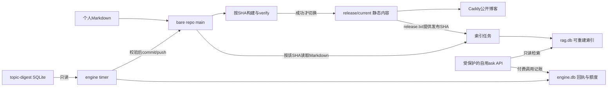

# nanmu-blog 架构

三件套:site(Astro 5 静态站,git 即 CMS)/ engine(M1,读 topic-digest SQLite 产日报)/ rag(M2,自用问答)。

图中M1/M2路径为目标设计,尚未实现。索引读取对应发布SHA的Markdown,不是对HTML抓取;API入口域名/路由在M2计划中定案。

## 数据流

1. **写作流**:人写 markdown → git push → post-receive后台有界等待锁 → 按SHA构建并verify → `releases/<sha>/dist` + `mv -T` 原子 symlink → Caddy
2. **AI 流(M1)**:engine 定时读 topic-digest(只读)→ 评分精选 → 摘要 → 专用副本生成digest markdown → commit/push → 同一构建链 → 线上确认
3. **RAG 流(M2)**:engine 建向量索引(独立 rag.db,可随时重建)→ FastAPI /ask(basicauth)→ Caddy 反代

## 边界不变量

- AI 挂了博客照常在线;engine 崩溃不影响静态站,反之亦然
- topic-digest 保持现状,本项目只读
- 页面永不调模型;读者只读预生成内容
- AI 生成内容必须标注(模型 + 成本)

铁律与详设:[superpowers/specs/2026-10-02-nanmu-blog-design.md](superpowers/specs/2026-10-02-nanmu-blog-design.md) · 决策记录:[decisions/](decisions/)

## 实现状态与失败边界

当前仅文档,M0 Task2尚未开始。M0发布流程详见计划Task8-10;后台锁等待不是持久化队列,重启/超时后需按runbook重跑。

- 静态旧版本可用不等于最新内容已发布;以release.txt和目标内容确认。
- rag.db是可重建语料/索引投影;RAG API只读该库,付费调用写统一engine账本。
- 同机系统故障/资源耗尽仍可能影响各服务;“AI失败不影响博客”指进程、数据与外部API故障隔离,不是整机故障保证。
